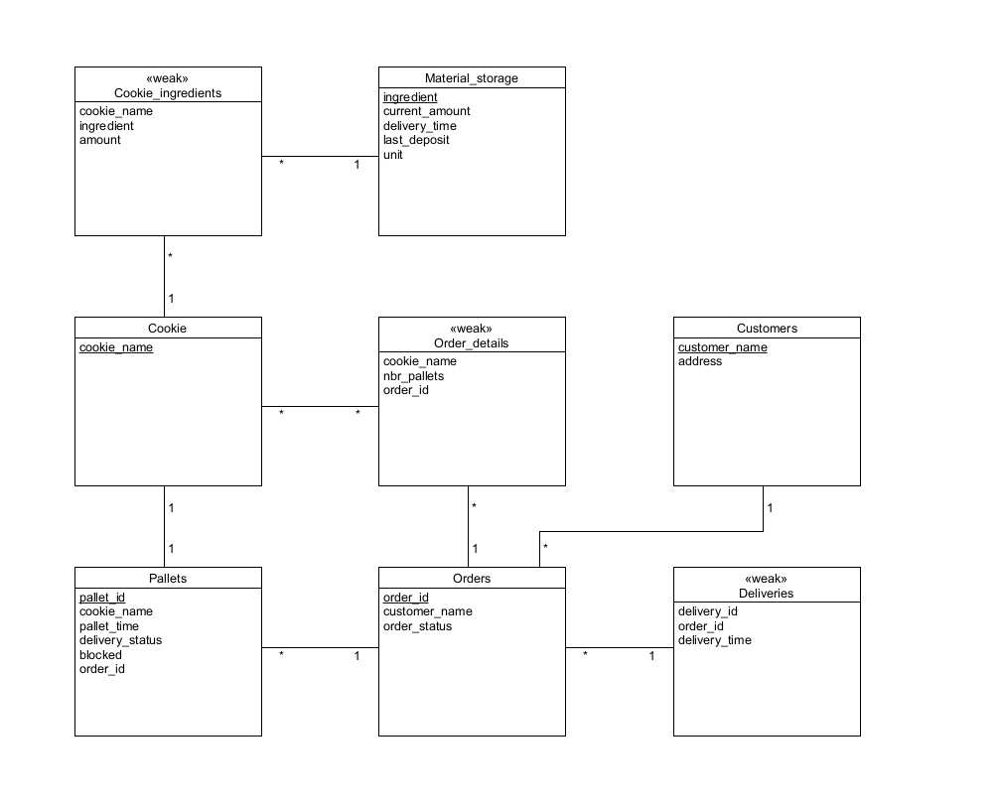

# EDAF75, project report

This is the report for

 + Robin Vinterbladh, `ro3413vi-s`
 + Gustav Jönemo, `gu1673jo-s `
 + Rebecka Källén, `elt14rka`

We solved this project on our own, except for:

 + The Peer-review meeting
 + 


## ER-design

The model is in the file [`er-model.png`](er-model.png):

<center>
    
</center>


## Relations

The ER-model above gives the following relations (neither
[Markdown](https://docs.gitlab.com/ee/user/markdown.html)
nor [HTML5](https://en.wikipedia.org/wiki/HTML5) handles
underlining withtout resorting to
[CSS](https://en.wikipedia.org/wiki/Cascading_Style_Sheets),
so we use bold face for primary keys, italicized face for
foreign keys, and bold italicized face for attributes which
are both primary keys and foreign keys):

+ Material_storage(**ingredient**, current_amount, delivery_time, last_deposit, unit)
+ Cookie_ingredients(cookie_name, ingredient, amount)
+ Cookies(**cookie_name**)
+ Pallets(**pallet_id**, cookie_name, pallet_time, delivery_status, blocked, order_id)
+ Order_details(cookie_name, nbr_pallets, order_id)
+ Orders(**order_id**, customer_name, order_status)
+ Customers(**customer_name**, address)
+ Deliveries(delivety_id, order_id, delivery_time)


## Scripts to set up database

The scripts used to set up and populate the database are in:

 + [`create-schema.sql`](create-schema.sql) (defines the tables), and
 + [`initial-data.sql`](initial-data.sql) (inserts data).

So, to create and initialize the database, we run:

```shell
sqlite3 krusty-db.sqlite < create-schema.sql
sqlite3 krusty-db.sqlite < initial-data.sql
```

(or whatever you call your database file).

## How to compile and run the program

This section should give a few simple commands to type to
compile and run the program from the command line, such as:

```shell
./gradlew run
```

or, if you put your commands into a `Makefile`:

```shell
make compile
make run
```
